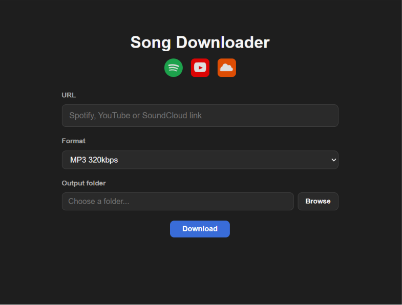

# Song Downloader

A desktop app to download songs and playlists from Spotify, YouTube, and SoundCloud as MP3 (320kbps) or AIFF.



---

## Download

Download the latest installer:

**[⬇ Download Song-Downloader.msi](https://github.com/TiesvdSar/Song-Downloader/releases/latest)**

---

## Installation

### 1. Install the app
Run the downloaded `.msi` file and follow the installer steps.

### 2. Install the required tools

The app needs three tools installed on your computer to work.

#### Python
Download and install Python from [python.org](https://www.python.org/downloads/).
> During installation, check **"Add Python to PATH"**.

#### yt-dlp
Open **Command Prompt** and run:
```
pip install yt-dlp
```

#### ffmpeg
Download and install ffmpeg using **winget**. Open **Command Prompt** and run:
```
winget install Gyan.FFmpeg
```

After installing, **restart your computer** to make sure everything is recognised.

---

## How to use

### 1. Paste a link
Copy a link from Spotify, YouTube, or SoundCloud and paste it into the URL field.

Supported links:
- `https://open.spotify.com/playlist/...`
- `https://www.youtube.com/watch?v=...`
- `https://www.youtube.com/playlist?list=...`
- `https://soundcloud.com/...`

### 2. Choose a format
Select **MP3 320kbps** or **AIFF** from the format dropdown.

### 3. Set a delay (optional)
Choose a delay between songs to avoid being throttled by YouTube:

| Option | Best for |
|--------|----------|
| None | Single songs or very short playlists |
| Light — 3–6s | Most playlists (recommended) |
| Safe — 8–16s | Large playlists (100+ songs) |

Already downloaded songs are always skipped instantly regardless of the delay setting.

### 4. Choose an output folder
Click **Browse** and select the folder where you want the songs saved.

### 5. Click Download
Click the **Download** button. The log at the bottom shows live progress. When everything is done you will see:
```
✓ Download complete.
```

### Already downloaded songs
If a song is already in the output folder it will be skipped automatically — no duplicates.

---

## Troubleshooting

**"Failed to start process"** — yt-dlp or Python is not installed correctly. Re-run the installation steps above and restart your computer.

**Download fails immediately** — ffmpeg may not be installed. Run `winget install Gyan.FFmpeg` in Command Prompt.

**Spotify downloads not working** — make sure `spotdl` is installed: `pip install spotdl`.
